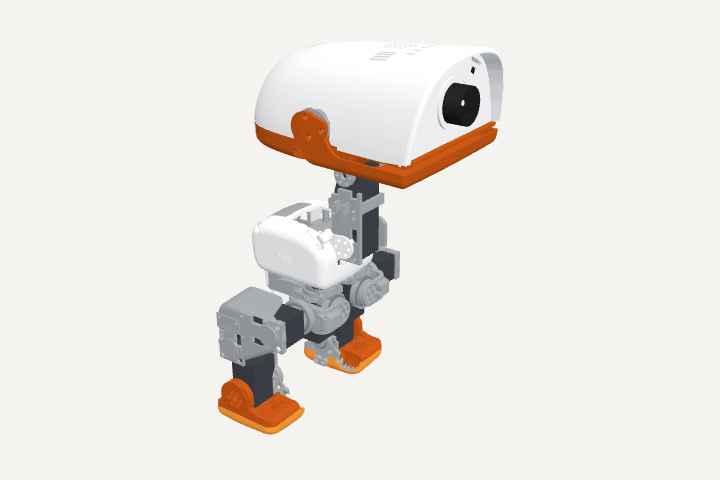

# microduck-s288

[English](README_EN.md) · 中文

用宇树 **S288** 舵机复刻 Pollen Robotics 的开源双足小鸭 [Microduck](https://github.com/pollen-robotics/microduck)。



<sub>打印件 · 舵机 · 轴承，按子总成散开再聚合。交互版（可拖动旋转）：[docs/explode.html](docs/explode.html)，下载后用浏览器打开。</sub>

> **状态（2026-10-01）：打印件已发打印店，整机还没装起来。** 本次把 **CAD 生成源码、Gate 检查体系和全部设计数据**放出来了（见下"仓库目录"）。
> Gate 还没全绿：剩下的红主要是等实物才能登记的项（起子杆长、坐面、元件质量）和原版同类的碰撞对。
> **请先不要按现在的内容去打印或采购**，STL、清单、装配顺序等整机装起来能站住后再上传（见"路线"）。

---

## 为什么要复刻

原版 Microduck 的仿真模型、训练代码和策略都开源了，但 **CAD 不公开**，用的 Dynamixel XL330 舵机在国内也不好买。
所以这个项目：

- **借**原版的仿真骨架与策略：14 条关节轴线一根不动，原版训练好的走路 / 起立 / 坐站策略作为能力基线；
- **重做**全部结构件：按宇树 S288（塑料齿、塑料壳、Ø10.5 分度圆、实测堵转 0.66 N·m）重新画可打印的结构，
  头壳、髋、偏航件、躯干壳等件在原版网格的毛坯上切削改造；头为了装下主控、摄像头和喇叭每侧放大了 10 mm；
- **重训**：结构和电机都变了，策略要在按我们 CAD 生成的仿真模型上重新训练，不迁就原版限位。

## 选型（已定案）

| 部件 | 型号 | 备注 |
|---|---|---|
| 舵机 | 宇树 S288 × 15 | 含嘴；总线 1 进 5 个一分二，分 6 条串联链；插座在背面两角、沿轴向背插（实物核过） |
| 主控 | Radxa ZERO 3W | 装在头里；摄像头、NPU、USB 直连已在板上跑通 |
| IMU | Adafruit 4438（LSM6DSOX，STEMMA QT） | 躯干前壁，I²C |
| 摄像头 | Radxa Camera 8M 219（IMX219） | 脸板 |
| 测距 | VL53L5CX 多区 ToF | 脸板，避障用 |
| 电池 | 3S 1100 mAh 30C，XT30 | 躯干后仓，后门推入；不用时拔插头 |
| 供电 | 12 V 直供舵机总线；UBEC 5 V/3 A 给主控 | |
| 材料 | PLA 为主；发热处（头支架、头壳、功放 / 转接板托板）PETG；脚底 TPU | |

## 仓库目录

```
docs/explode.gif, docs/explode.html   零件爆炸动画（首页那张）与交互版
docs/gate/                            Gate 体系的校验记录与独立审计
duckstructure/                        整鸭 CAD 参数化生成（Python：trimesh + manifold），按身体部位分文件；data/ 是让位区域网格与头放大缓存
tools/cad/                            装配 / 机械审计、孔与清理检查等（build 和 Gate 共用）
tools/gate/                           Gate 8 层检查：gate.py 入口、layers/ 各层、data/ 设计数据 yaml、negatives/ 反例回归、slicing/ 切片检查
tools/sim/                            MJCF 生成、原版策略真实姿态采样、运动守卫
scripts/fetch_upstream.sh             拉取 Pollen 上游仓库到 upstream/（本仓库不分发它们的文件）
requirements.txt                      依赖版本
```

**Gate 的八层**：L0 网格合法性 → L1 可打印性（真切片）→ L2 特征是否真的切出来 → L3 零位干涉 → L4 装配路径与起子可达 →
L5 螺丝咬入与坐面 → L6 全行程与真实姿态碰撞 → L7 质量与扭矩。每层的判据只写不变量，红绿逐条留证据和出处；
`negatives/` 是反例包，每条判据都有"故意做坏的件必须变红"的回归，改判据先过反例。细节见 [tools/gate/README.md](tools/gate/README.md)。

### 怎么跑

```bash
python3 -m venv .venv && .venv/bin/pip install -r requirements.txt
scripts/fetch_upstream.sh                      # 上游仿真骨架与策略
.venv/bin/python -m duckstructure.build        # 生成 cad/duck_s288/（含 placed/ 装配位网格；十几分钟，吃内存）
.venv/bin/python tools/gate/gate.py            # 全量 Gate，结果在 tools/gate/out/（反例包约 7 min，各层另计）
```

L1 真切片要本机装 PrusaSlicer（`tools/gate/slicing/slice_l1.py --exe` 指定路径），没装时该层标 unknown，不冒充绿。

## 现在到哪一步了

- **CAD**：37 种 / 46 件打印件，全部参数化生成，改一个尺寸整鸭重出；第 8 版打印包已发打印店（左脚先试打）。
- **Gate**：全链能跑通，当前仍有数百条红——多数是"等实物才能填"的登记项（起子杆长、坐面、元件实测质量）和原版同类的碰撞对，
  每条都在 scorecard 里带出处。
- **仿真 / 训练**：按我们 CAD 重生成 MuJoCo 模型；走路 / 起立 / 坐站三个策略已在仿真里训过一轮；头比训练时重，正在做重量极限测试。
- **实物**：舵机、主控、摄像头、IMU、电池到手；主控板烧卡、联网、摄像头、NPU 推理跑通；板端运行时只做到读传感器，还没上力；**整机未装**。

## 路线（上传节奏跟着这个走）

1. ☑ 说明 + 许可证
2. ☑ CAD 源码、Gate 体系与设计数据（本次；Gate 全绿和独立复审在实物装起来的过程中补齐）
3. ☐ 打印件实物装机、能站住 → 上传 STL、打印清单、采购清单、装配顺序
4. ☐ 策略重训完成、实物能走 → 上传仿真场景、权重、训练配置
5. ☐ 主控端运行时（IMU、总线驱动、策略推理）

## 许可证

- **代码**（`duckstructure/*.py`、`tools/`、`scripts/`）：[Apache License 2.0](LICENSE)
- **硬件 / 3D 模型与设计数据**（`duckstructure/data/`、`tools/gate/data/`、`docs/` 里的网格与渲染）：[CC BY-NC-SA 4.0](LICENSE-HARDWARE.md) ——
  原版模型是 CC BY-SA-NC，我们的件是它的衍生作品，**不得商用**，再分发须署名 Pollen Robotics。
- 来源与致谢见 [NOTICE.md](NOTICE.md)。宇树 S288 手册受版权保护，本仓库不分发。

## 联系

Issue 区。项目还在早期，欢迎提问，但请理解"还不能装"这个前提。
